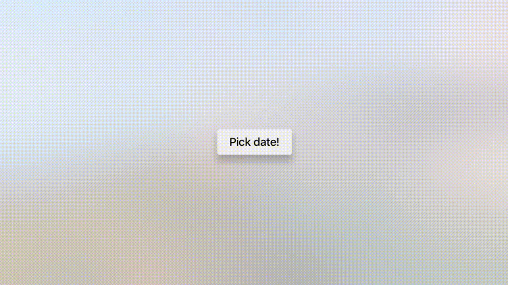

TVMultiPicker
===

* Simple generic viewcontroller with arbitrary number of pickers.
* Contains pre-configured date picker
* Supports user defined style configuration

Demo
----



Requirements
----

- Swift 3.0+
- tvOS 9.0+

Install
----

### Swift 3

```
# in your tvOS target
use_frameworks!
pod 'TVMultiPicker', '~> 0.0.3'

```

### Swift 4

```
# in your tvOS target
use_frameworks!
pod 'TVMultiPicker', '~> 0.0.4'

```

Usage
----

### Basics

In order to use this library it's necessary to create instance of `MultiPickerViewController<T>`.

`<T>` is the type of value generated by picker. 

User has to provide `ProcessDataAction: ([(index: Int, value: String)]) -> T?` action which can generate
value from given array of selected items in multiple pickers.

Pickers are defined in a following way:
```swift
let examplePicker = PickerDefinition(
    data: ["Item 1", "Item 2"],    // Items displayed in horizontal list
    cellWidth: 100,                // Width of each item cell (can be nil for auto-calculated width!)
    initialValueIndex: 0,          // "Item 1" will initially be focused
    remembersLastFocusedElement: true // Remembers focused element when horizontal list regains focus 
)
```

### Real example

For example, let's create simple multi picker containing two pickers with auto-calculated cell widths.
First one will be gender picker while second one will represent country picker.
In the end we want to get picked value in `String` format: "Male, Croatia".
After user has picked value, we'll dismiss picker and print value to console.

```swift
let pickerVC = MultiPickerViewController<String>(
    [
        PickerDefinition(
            data: ["Male", "Female"],
            cellWidth: nil,
            initialValueIndex: 0,
            remembersLastFocusedElement: true
        ),
        PickerDefinition(
            data: ["Croatia", "France", "Italy", "Spain"],
            cellWidth: nil,
            initialValueIndex: 0,
            remembersLastFocusedElement: true
        )
    ],
    initialPickerIndex: 0,                  // Initially focused picker will be gender picker
    configuration: .defaultConfig,          // UI configuration set to default red/black style
    processDataAction: { pickedValues in
        return pickedValues[0].value + ", " + pickedValues[1].value
    },
    valuePickedAction: { finalValue, picker in
        picker.dismiss(animated: true, completion: nil)
        print(finalValue)
    }
)

// present pickerVC and everything is set-up
```

### Date picker

Library also contains pre-made date picker. It can be used in following way:

```swift
let picker = MultiPicker.datePicker(
    startYear: 1900,            // Lower year bound
    initialYear: 1990,          // Initially focused year
    configuration: .defaultConfig
) { date, picker in
        picker.dismiss(animated: true, completion: nil)
        print(date)
}
```
